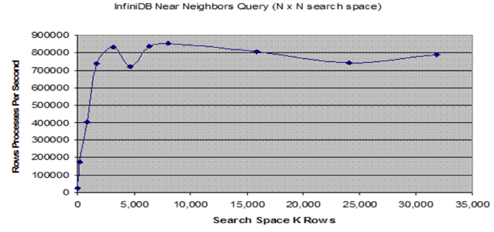
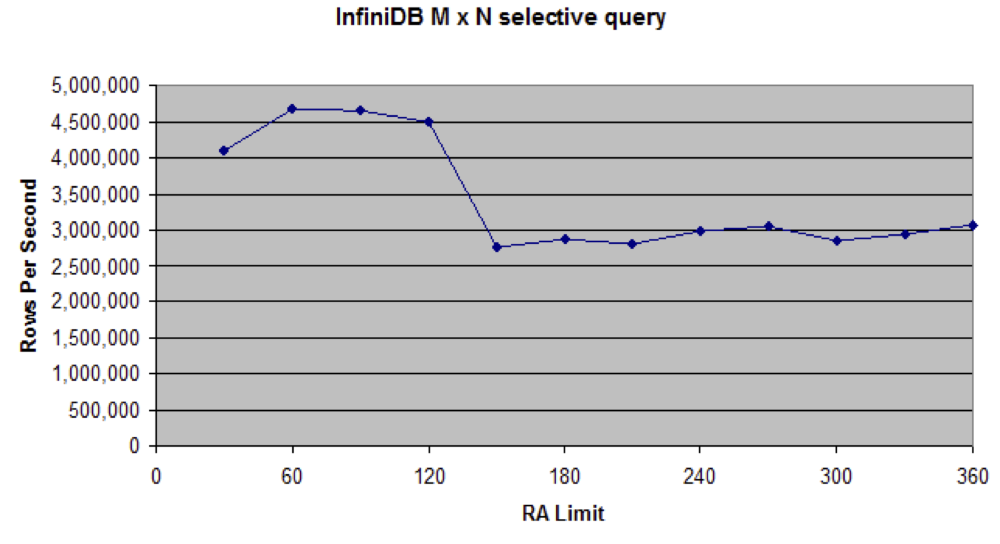

..
  Technote content.

  See https://developer.lsst.io/docs/rst_styleguide.html
  for a guide to reStructuredText writing.

  Do not put the title, authors or other metadata in this document;
  those are automatically added.

  Use the following syntax for sections:

  Sections
  ========

  and

  Subsections
  -----------

  and

  Subsubsections
  ^^^^^^^^^^^^^^

  To add images, add the image file (png, svg or jpeg preferred) to the
  _static/ directory. The reST syntax for adding the image is

  .. figure:: /_static/filename.ext
     :name: fig-label
     :target: http://target.link/url

     Caption text.

   Run: ``make html`` and ``open _build/html/index.html`` to preview your work.
   See the README at https://github.com/lsst-sqre/lsst-technote-bootstrap or
   this repo's README for more info.

   Feel free to delete this instructional comment.

:tocdepth: 1

.. Please do not modify tocdepth; will be fixed when a new Sphinx theme is shipped.

.. sectnum::

.. Add content below. Do not include the document title.

.. note::

   In late 2010 we collaborated with the Calpont team on testing their
   InfiniDB product. Testing involved executing the most complex queries
   such as near neigbor on 1 billion row USNOB catalog. The tests were
   run by Jim Tommaney, the final results are pasted below.

Tests and Results
-----------------

Thank you for the chance to evaluate InfiniDB against the stellar data
set and the near neighbor problem. Towards that end I installed our 2.0
version on a Dell 610 server with 16GB memory, 8 physical cores (16
Hyper-Threaded Intel virtual cores), and a 4 disk raid 0 data mount
point with 7200 RPM disk drives.

As you know, the N-squared search space becomes problematic at scale, so
part of the solution involved a specialized query and the addition of 4
additional columns as shown below. These new columns defined two
overlapping grids on top of the search space such that any given object
existed in 2 grids. Note that these are abstract grids represented by
additional columns and the table is a single table with our standard
vertical + horizontal partitioning that happens with the basic create
table statement. So, this virtual 'gridding' doesn't change other
characteristics of the table or prevent other such extensions.

Column additions:

.. code:: sql

   alter table object add column ra_r2 decimal(5,2);
   alter table object add column decl_r2 decimal(4,2);
   alter table object add column ra_d2 decimal(5,2);
   alter table object add column decl_d2 decimal(4,2);

Example update statements:

.. code:: sql

   update object set ra_r2 = round(ra,2) where ra < 10;
   update object set decl_r2 = round(decl,2) where ra < 10;
   update object set ra_d2 = truncate(ra,2) where ra < 10;
   update object set decl_d2 = truncate(decl,2) where ra < 10;

The query itself consist of 4 parts, the sum of which is the count
of near neighbors.

1. Search within Grid D defined by ``ra_d2``, ``decl_d2``. 

2. Search within Grid R defined by ``ra_r2``, ``decl_r2``, adding
   predicates to only include matches that span two D Grids.

   .. code:: sql

      and (( o1.ra_d2 <> o2.ra_d2 ) or (o1.decl_d2 <> o2.decl_d2))

3. There is the additional condition where a given pair of neighbors
   span both Grid D and Grid R. For this subset of the data, the
   neighboring objects share Grid R coordinates for RA, and Grid D
   coordinates for Decl.

   .. code:: sql

      FROM object o1 join object o2 on
           (o1.ra_r2 = o2.ra_r2 and o1.decl_d2 = o2.decl_d2)

4. The last case covers the same basic condition as 3, but includes a
   join that covers neighboring objects that share Grid D coordinates
   for RA, and Grid R coordinates for Decl.

   .. code:: sql

      FROM object o1 join object o2 on
           (o1.ra_d2 = o2.ra_d2 and o1.decl_r2 = o2.decl_r2)

Anyway, the results appear very promising, and indicate that it may
satisfy arbitrarily large search spaces. I executed the query
against the full range of declination, and searched with the range
of RA between 0 and ``ra_limit``. I then scaled ``ra_limit`` between 0.01
through 20 and charted the results below, trending search space vs.
rows processed per second. The baseline numbers you provided appear
to avg. about 1000 rows/second, and capped out at about 80k search
space. With InfiniDB, the search rate is relatively flat after a
ramp-up of a couple seconds, running at about ~800 K rows processed
per second through a search space of about 32 M x 32 M objects. At
32M objects x 32M objects the query consumed about 6GB for the hash
structures, however extending the query logic above would allow for
running something like 33 of these queries serially to search
through a 1B x 1B space. Running the 4 sections serially would
reduce the memory requirements if desired.

.. _fig-infinidb-near-neighbors:

   InfiniDB Near Neighbors Cluster Query (N x N).

There are a number of variations on the near neighbor problem that
provide a filter on one of the object tables, i.e. search for white
dwarf that I would characterize as M x N problems where M << N. To
profile those queries I selected an arbitrary filter ``( o1.bMag > 24.9
)`` that restricted 1 of the 2 sides of the join to at most ~330 K
objects. I then executed 12 queries with ra between 0 and ``ra_limit``,
varying ``ra_limit`` from 30 to 360. Each query was executed 3 times
sequentially following a flush of the data buffer cache, and the average
of the three values charted.

With a bounded M, the processing rate went up significantly,
approaching 4.5 M rows per second when the second and third
executions of a query were satisfied from cache, and running at
nearly 3 M rows per second for larger queries that did not fit in
the data buffer cache ( which was configured at 8 GB ). These
queries only used about 6% of memory for temporary space and could
be run against an arbitrarily large N as desired.

.. _fig-infinidb-m-n-selective-query:

   InfiniDB M x N selective query.

There are more details regarding the load rate, options on other
grid sizes, limitation of this style grid analysis for larger
definitions of 'near', etc. that can be shared and reviewed as
desired, and I am more than happy to profile additional queries as
desired. For example, I can take a look at getting an exact time for
finding all of the near-neighbors within a 1B x 1B search space if
that is interesting (should be something like 23-25 minutes), it is
just a matter of tweaking the query restrictions to allow proper
handling of objects on each side of these larger query boundary.

There are definitely some significant differences between InfiniDB
and MySQL in terms of best practices for a number of items. For
example, our fastest load capability is via cpimport rather than
load data infile. The near neighbors problem appears to be one
example of many where we handle large data analysis significantly
better than MySQL, although there are plenty of examples where MySQL
shines relative to InfinDB (individual row insertion, individual
record access via index, etc). Any external application that relies
on individual row lookups with an expected latency in the
microseconds will run significantly slower with InfiniDB.

.. code:: sql

   select sum(cnt) from (
     SELECT count(*) cnt
     FROM object o1 join object o2 using(ra_d2, decl_d2)
     WHERE ABS(o1.ra - o2.ra) < 0.00083 / o2.cosRadDecl AND ABS(o1.decl -
           o2.decl) < 0.00083 and o1.objectid <> o2.objectid
           and o1.ra >= 0 and o1.ra < @ra_limit and o1.bMag > 24.9
           and o2.ra >= 0 and o2.ra < @ra_limit
     union all
     SELECT count(*) cnt
     FROM object o1 join object o2 using(ra_r2, decl_r2)
     WHERE ABS(o1.ra - o2.ra) < 0.00083 / o2.cosRadDecl
           and ABS(o1.decl - o2.decl) < 0.00083
           and o1.objectid <> o2.objectid
           and o1.ra >= 0 and o1.ra < @ra_limit and o1.bMag > 24.9
           and o2.ra >= 0 and o2.ra < @ra_limit
           and (( o1.ra_d2 <> o2.ra_d2 ) or (o1.decl_d2 <> o2.decl_d2))
     union all
     select count(*) cnt
     FROM object o1 join object o2 on (o1.ra_r2 = o2.ra_r2 and
          o1.decl_d2 = o2.decl_d2 )
     WHERE ABS(o1.ra - o2.ra) < 0.00083 / o2.cosRadDecl AND
           ABS(o1.decl - o2.decl) < 0.00083
           and o1.ra_d2 <> o2.ra_d2
           and o1.decl_r2 <> o2.decl_r2
           and abs(o1.ra - o1.ra_r2) * o1.cosRadDecl < 0.00083
           and abs(o2.ra - o2.ra_r2) * o2.cosRadDecl < 0.00083
           and abs(o1.decl - (o1.decl_d2 + 0.005)) < 0.00083
           and abs(o2.decl - (o2.decl_d2 + 0.005)) < 0.00083
           and o1.objectid <> o2.objectid
           and o1.ra >= 0 and o1.ra < @ra_limit and o1.bMag > 24.9
           and o2.ra >= 0 and o2.ra < @ra_limit
     union all
     select count(*) cnt
     FROM object o1 join object o2 on (o1.ra_d2 = o2.ra_d2 and
          o1.decl_r2 = o2.decl_r2 )
     WHERE ABS(o1.ra - o2.ra) < 0.00083 / o2.cosRadDecl AND
           ABS(o1.decl - o2.decl) < 0.00083
           and o1.ra_r2 <> o2.ra_r2
           and o1.decl_d2 <> o2.decl_d2
           and abs(o1.ra - (o1.ra_d2 + 0.005)) * o1.cosRadDecl < 0.00083
           and abs(o2.ra - (o2.ra_d2 + 0.005)) * o2.cosRadDecl < 0.00083
           and abs(o1.decl - o1.decl_r2 ) < 0.00083
           and abs(o2.decl - o2.decl_r2 ) < 0.00083
           and o1.objectid <> o2.objectid
           and o1.ra >= 0 and o1.ra < @ra_limit and o1.bMag > 24.9
           and o2.ra >= 0 and o2.ra < @ra_limit
   ) a;

.. code:: text

   mysql> set @ra_limit:= 0.01;

   Query OK, 0 rows affected (0.00 sec)

   mysql> . near_neighbors.sql

   +----------+------------------------+--------------------------+
   | count(*) | count(distinct(ra_d2)) | count(distinct(decl_d2)) |
   +----------+------------------------+--------------------------+
   | 16652    | 1                      | 8643                     |
   +----------+------------------------+--------------------------+

   1 row in set (0.07 sec)

   +----------+
   | sum(cnt) |
   +----------+
   | 2834     |
   +----------+

   1 row in set (0.60 sec)

   +----------------------------------------------------------------------------------------------------+
   | idb()                                                                                              |
   +----------------------------------------------------------------------------------------------------+
   | Query Stats: MaxMemPct-0; ApproxPhyI/O-0; CacheI/O-0; BlocksTouched-0; PartitionBlocksEliminated-0 |
   +----------------------------------------------------------------------------------------------------+

   1 row in set (0.00 sec)

.. code:: text

   mysql> set @ra_limit:= 0.1;

   Query OK, 0 rows affected (0.00 sec)

   mysql> . near_neighbors.sql

   +----------+------------------------+--------------------------+
   | count(*) | count(distinct(ra_d2)) | count(distinct(decl_d2)) |
   +----------+------------------------+--------------------------+
   | 167632   | 10                     | 17048                    |
   +----------+------------------------+--------------------------+

   1 row in set (0.08 sec)

   +----------+
   | sum(cnt) |
   +----------+
   | 31757    |
   +----------+

   1 row in set (0.95 sec)

   +----------------------------------------------------------------------------------------------------+
   | idb()                                                                                              |
   +----------------------------------------------------------------------------------------------------+
   | Query Stats: MaxMemPct-6; ApproxPhyI/O-0; CacheI/O-0; BlocksTouched-0; PartitionBlocksEliminated-0 |
   +----------------------------------------------------------------------------------------------------+

   1 row in set (0.00 sec)

.. code:: text

   mysql> set @ra_limit:= 0.5;

   Query OK, 0 rows affected (0.00 sec)

   mysql> . near_neighbors.sql

   +----------+------------------------+--------------------------+
   | count(*) | count(distinct(ra_d2)) | count(distinct(decl_d2)) |
   +----------+------------------------+--------------------------+
   | 833849   | 50                     | 17812                    |
   +----------+------------------------+--------------------------+

   1 row in set (0.16 sec)

   +----------+
   | sum(cnt) |
   +----------+
   | 155065   |
   +----------+

   1 row in set (2.07 sec)

   +----------------------------------------------------------------------------------------------------+
   | idb()                                                                                              |
   +----------------------------------------------------------------------------------------------------+
   | Query Stats: MaxMemPct-6; ApproxPhyI/O-0; CacheI/O-0; BlocksTouched-0; PartitionBlocksEliminated-0 |
   +----------------------------------------------------------------------------------------------------+

   1 row in set (0.00 sec)

.. code:: text

   mysql> set @ra_limit:= 1;

   Query OK, 0 rows affected (0.00 sec)

   mysql> . near_neighbors.sql

   +----------+------------------------+--------------------------+
   | count(*) | count(distinct(ra_d2)) | count(distinct(decl_d2)) |
   +----------+------------------------+--------------------------+
   | 1638966  | 100                    | 17891                    |
   +----------+------------------------+--------------------------+

   1 row in set (0.21 sec)

   +----------+
   | sum(cnt) |
   +----------+
   | 290972   |
   +----------+

   1 row in set (2.22 sec)

   +----------------------------------------------------------------------------------------------------+
   | idb()                                                                                              |
   +----------------------------------------------------------------------------------------------------+
   | Query Stats: MaxMemPct-7; ApproxPhyI/O-0; CacheI/O-0; BlocksTouched-0; PartitionBlocksEliminated-0 |
   +----------------------------------------------------------------------------------------------------+

   1 row in set (0.00 sec)

.. code:: text

   mysql> set @ra_limit:= 2;

   Query OK, 0 rows affected (0.00 sec)

   mysql> . near_neighbors.sql

   +----------+------------------------+--------------------------+
   | count(*) | count(distinct(ra_d2)) | count(distinct(decl_d2)) |
   +----------+------------------------+--------------------------+
   | 3153437  | 200                    | 17947                    |
   +----------+------------------------+--------------------------+

   1 row in set (0.25 sec)

   +----------+
   | sum(cnt) |
   +----------+
   | 516670   |
   +----------+

   1 row in set (3.79 sec)

   +----------------------------------------------------------------------------------------------------+
   | idb()                                                                                              |
   +----------------------------------------------------------------------------------------------------+
   | Query Stats: MaxMemPct-8; ApproxPhyI/O-0; CacheI/O-0; BlocksTouched-0; PartitionBlocksEliminated-0 |
   +----------------------------------------------------------------------------------------------------+

   1 row in set (0.00 sec)

.. code:: text

   mysql> set @ra_limit:= 3;

   Query OK, 0 rows affected (0.00 sec)

   mysql> . near_neighbors.sql

   +----------+------------------------+--------------------------+
   | count(*) | count(distinct(ra_d2)) | count(distinct(decl_d2)) |
   +----------+------------------------+--------------------------+
   | 4675828  | 300                    | 17961                    |
   +----------+------------------------+--------------------------+

   1 row in set (0.28 sec)

   +----------+
   | sum(cnt) |
   +----------+
   | 734540   |
   +----------+

   1 row in set (6.51 sec)

   +----------------------------------------------------------------------------------------------------+
   | idb()                                                                                              |
   +----------------------------------------------------------------------------------------------------+
   | Query Stats: MaxMemPct-9; ApproxPhyI/O-0; CacheI/O-0; BlocksTouched-0; PartitionBlocksEliminated-0 |
   +----------------------------------------------------------------------------------------------------+

   1 row in set (0.01 sec)

.. code:: text

   mysql> set @ra_limit:= 4;

   Query OK, 0 rows affected (0.00 sec)

   mysql> . near_neighbors.sql

   +----------+------------------------+--------------------------+
   | count(*) | count(distinct(ra_d2)) | count(distinct(decl_d2)) |
   +----------+------------------------+--------------------------+
   | 6356011  | 400                    | 17967                    |
   +----------+------------------------+--------------------------+

   1 row in set (0.40 sec)

   +----------+
   | sum(cnt) |
   +----------+
   | 1037556  |
   +----------+

   1 row in set (7.61 sec)

   +-----------------------------------------------------------------------------------------------------+
   | idb()                                                                                               |
   +-----------------------------------------------------------------------------------------------------+
   | Query Stats: MaxMemPct-13; ApproxPhyI/O-0; CacheI/O-0; BlocksTouched-0; PartitionBlocksEliminated-0 |
   +-----------------------------------------------------------------------------------------------------+

   1 row in set (0.00 sec)

.. code:: text

   mysql> set @ra_limit:= 5;

   Query OK, 0 rows affected (0.00 sec)

   mysql> . near_neighbors.sql

   +----------+------------------------+--------------------------+
   | count(*) | count(distinct(ra_d2)) | count(distinct(decl_d2)) |
   +----------+------------------------+--------------------------+
   | 7989071  | 500                    | 17975                    |
   +----------+------------------------+--------------------------+

   1 row in set (0.46 sec)

   +----------+
   | sum(cnt) |
   +----------+
   | 1326087  |
   +----------+

   1 row in set (9.38 sec)

   +-----------------------------------------------------------------------------------------------------+
   | idb()                                                                                               |
   +-----------------------------------------------------------------------------------------------------+
   | Query Stats: MaxMemPct-14; ApproxPhyI/O-0; CacheI/O-0; BlocksTouched-0; PartitionBlocksEliminated-0 |
   +-----------------------------------------------------------------------------------------------------+

   1 row in set (0.00 sec)

.. code:: text

   mysql> set @ra_limit:= 10;

   Query OK, 0 rows affected (0.00 sec)

   mysql> . near_neighbors.sql

   +----------+------------------------+--------------------------+
   | count(*) | count(distinct(ra_d2)) | count(distinct(decl_d2)) |
   +----------+------------------------+--------------------------+
   | 15896387 | 1000                   | 17986                    |
   +----------+------------------------+--------------------------+

   1 row in set (0.92 sec)

   +----------+
   | sum(cnt) |
   +----------+
   | 2609059  |
   +----------+

   1 row in set (19.71 sec)

   +-----------------------------------------------------------------------------------------------------+
   | idb()                                                                                               |
   +-----------------------------------------------------------------------------------------------------+
   | Query Stats: MaxMemPct-18; ApproxPhyI/O-0; CacheI/O-0; BlocksTouched-0; PartitionBlocksEliminated-0 |
   +-----------------------------------------------------------------------------------------------------+

   1 row in set (0.01 sec)

.. code:: text

   mysql> set @ra_limit:= 15;

   Query OK, 0 rows affected (0.00 sec)

   mysql> . near_neighbors.sql

   +----------+------------------------+--------------------------+
   | count(*) | count(distinct(ra_d2)) | count(distinct(decl_d2)) |
   +----------+------------------------+--------------------------+
   | 24045205 | 1500                   | 17993                    |
   +----------+------------------------+--------------------------+

   1 row in set (1.34 sec)

   +----------+
   | sum(cnt) |
   +----------+
   | 3949531  |
   +----------+

   1 row in set (32.46 sec)

   +-----------------------------------------------------------------------------------------------------+
   | idb()                                                                                               |
   +-----------------------------------------------------------------------------------------------------+
   | Query Stats: MaxMemPct-28; ApproxPhyI/O-0; CacheI/O-0; BlocksTouched-0; PartitionBlocksEliminated-0 |
   +-----------------------------------------------------------------------------------------------------+

   1 row in set (0.01 sec)

.. code:: text

   mysql> set @ra_limit:= 20;

   Query OK, 0 rows affected (0.00 sec)

   mysql> . near_neighbors.sql

   +----------+------------------------+--------------------------+
   | count(*) | count(distinct(ra_d2)) | count(distinct(decl_d2)) |
   +----------+------------------------+--------------------------+
   | 31841849 | 2000                   | 17996                    |
   +----------+------------------------+--------------------------+

   1 row in set (1.74 sec)

   +----------+
   | sum(cnt) |
   +----------+
   | 5247760  |
   +----------+

   1 row in set (40.48 sec)

   +-----------------------------------------------------------------------------------------------------+
   | idb()                                                                                               |
   +-----------------------------------------------------------------------------------------------------+
   | Query Stats: MaxMemPct-37; ApproxPhyI/O-0; CacheI/O-0; BlocksTouched-0; PartitionBlocksEliminated-0 |
   +-----------------------------------------------------------------------------------------------------+

   1 row in set (0.00 sec)

``lsst_near_neighbors.sql``:

.. code:: sql

   select sum(cnt) from (
     SELECT count(*) cnt
     FROM object o1 join object o2 using(ra_d2, decl_d2)
     WHERE ABS(o1.ra - o2.ra) < 0.00083 / o2.cosRadDecl AND ABS(o1.decl -
     o2.decl) < 0.00083 and o1.objectid < o2.objectid
     and o1.ra >= 0 and o1.ra < @ra_limit
     and o2.ra >= 0 and o2.ra < @ra_limit
     union all
     SELECT count(*) cnt
     FROM object o1 join object o2 using(ra_r2, decl_r2)
     WHERE ABS(o1.ra - o2.ra) < 0.00083 / o2.cosRadDecl
     and ABS(o1.decl - o2.decl) < 0.00083
     and o1.objectid < o2.objectid
     and o1.ra >= 0 and o1.ra < @ra_limit
     and o2.ra >= 0 and o2.ra < @ra_limit
     and (( o1.ra_d2 <> o2.ra_d2 ) or (o1.decl_d2 <> o2.decl_d2))
     union all
     select count(*) cnt
     FROM object o1 join object o2 on (o1.ra_r2 = o2.ra_r2 and
     o1.decl_d2 = o2.decl_d2 )
     WHERE ABS(o1.ra - o2.ra) < 0.00083 / o2.cosRadDecl AND
     ABS(o1.decl - o2.decl) < 0.00083
     and o1.ra_d2 <> o2.ra_d2
     and o1.decl_r2 <> o2.decl_r2
     and abs(o1.ra - o1.ra_r2) * o1.cosRadDecl < 0.00083
     and abs(o2.ra - o2.ra_r2) * o2.cosRadDecl < 0.00083
     and abs(o1.decl - (o1.decl_d2 + 0.005)) < 0.00083
     and abs(o2.decl - (o2.decl_d2 + 0.005)) < 0.00083
     and o1.objectid < o2.objectid
     and o1.ra >= 0 and o1.ra < @ra_limit
     and o2.ra >= 0 and o2.ra < @ra_limit
     union all
     select count(*) cnt
     FROM object o1 join object o2 on (o1.ra_d2 = o2.ra_d2 and
     o1.decl_r2 = o2.decl_r2 )
     WHERE ABS(o1.ra - o2.ra) < 0.00083 / o2.cosRadDecl AND
     ABS(o1.decl - o2.decl) < 0.00083
     and o1.ra_r2 <> o2.ra_r2
     and o1.decl_d2 <> o2.decl_d2
     and abs(o1.ra - (o1.ra_d2 + 0.005)) * o1.cosRadDecl < 0.00083
     and abs(o2.ra - (o2.ra_d2 + 0.005)) * o2.cosRadDecl < 0.00083
     and abs(o1.decl - o1.decl_r2 ) < 0.00083
     and abs(o2.decl - o2.decl_r2 ) < 0.00083
     and o1.objectid < o2.objectid
     and o1.ra >= 0 and o1.ra < @ra_limit
     and o2.ra >= 0 and o2.ra < @ra_limit
   ) a;

References
----------

.. bibliography:: bibliography.bib
   :encoding: latex+latin
   :style: lsst_aa

.. note::

   This document was originally published as an appendix of :cite:`Document-11625` and then part of :cite:`LDM-135`.
